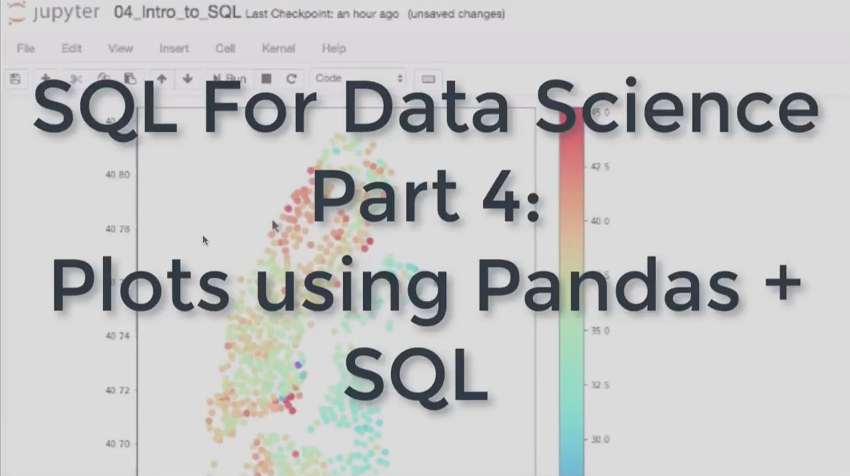

## Round 1 of 100DaysOfCode

My journey through 100 days of ML code. 

Minha jornada do desafio 100 dias de código de Machine Learning

emoticon for commit https://gitmoji.carloscuesta.me/
#100DaysOfCode

## Round 1 - 087/142 - from 01/05/2020 to 19/06/2020 - Saturday
Scientific Computing and Python for Data Science course completed!
 #100DaysOfCode
 <image  width="50%" height="50%" src="./img/logo1.png">
 
## Round 1 - 060/142 23/05/2020 - Sunday
Studying The Data incubator lessons
 #100DaysOfMLCode

## Round 1 - 059/142 22/05/2020 - Saturday
Paused for 9 days, I had to work on night again.
Using linear regression on Power BI
 #100DaysOfMLCode

## Round 1 - 058/133 21/05/2020 - Thursday
Reading R documentation about vroom to manage large datasets
 #100DaysOfMLCode

## Round 1 - 057/133 20/05/2020 - Wednesday
Solving problems on R and Power BI
 #100DaysOfMLCode

## Round 1 - 056/133 19/05/2020 - Tuesday
Paused for a week, I had to work on night
 #100DaysOfMLCode
 <image  width="50%" height="50%" src="./img/15659707052_4172a0a8ce_b.jpg">

## Round 1 - 055/124 10/05/2020 - Sunday 
 Learning Azure platform   
 #100DaysOfMLCode

## Round 1 - 054/124 09/05/2020 - Saturday 
 Doing exercises of linear algebra   
 #100DaysOfMLCode

## Round 1 - 053/124 08/05/2020 - Friday
 Playing hackaton on qwiklabs
 #100DaysOfMLCode
https://google.qwiklabs.com/games/921

## Round 1 - 052/124 07/05/2020 - Thursday 
 Learnig ML kit(Microsoft)
 #100DaysOfMLCode

## Round 1 - 051/124 06/05/2020 - Wednesday 
 Playing Qwiklabs 
 #100DaysOfMLCode
 <image  width="50%" height="50%" src="./img/dfsdfunnamed.png">

## Round 1 - 050/124 05/05/2020 - Tuesday 
 Studying lifecycle in datascience, part II
 #100DaysOfMLCode

## Round 1 - 049/124 04/05/2020 - Monday 
 Studying lifecycle in datascience
 #100DaysOfMLCode

## Round 1 - 048/124 03/05/2020 - Sunday 
 Pandas, Numpy, seaborn for read, stats and view = Part II
 #100DaysOfMLCode

## Round 1 - 047/124 02/05/2020 - Saturday 
 Pandas, Numpy, seaborn for read, stats and view
 #100DaysOfMLCode

## Round 1 - 046/124 01/05/2020 - Friday 
 Part II -Trainning  my ability to wrangle tabular data set and aggregate large data sets into meaningful summary statistics
 #100DaysOfMLCode

## Round 1 - 045/124 30/04/2020 - Thursday 
 Trainning  my ability to wrangle tabular data set and aggregate large data sets into meaningful summary statistics
 #100DaysOfMLCode
 <image  width="50%" height="50%" src="./img/dowsdfsdnload.png">

## Round 1 - 044/124 29/04/2020 - Wednesday 
 K-means clustering algorithm - implementation finished in python
 #100DaysOfMLCode

## Round 1 - 043/124 28/04/2020 - Tuesday 
 Still learning K-means clustering algorithm in the deep
 #100DaysOfMLCode

## Round 1 - 042/124 27/04/2020 - Monday 
 Learning K-means clustering algorithm in the deep
 #100DaysOfMLCode
 <image  width="50%" height="50%" src="./img/K-means_convergence.gif">

## Round 1 - 041/124 26/04/2020 - Sunday 
 Solving data-wrangling problems on WQU - WorldQuant University
 #100DaysOfMLCode

## Round 1 - 040/124 25/04/2020 - Saturday 
Apache Zeppelin or Jupyter notebook ?
 ps.: I was paused daily code for exams, now I return \o
 #100DaysOfMLCode
 <image  width="50%" height="50%" src="./img/download (1).png">
 <image  width="50%" height="50%" src="./img/downlosad.jpg">
 
 
## Round 1 - 039/114 15/04/2020 - Wednesday 
Studying linear transformations on python
 #100DaysOfMLCode

## Round 1 - 038/114 14/04/2020 - Tuesday
Apply for learn
 https://wqu.org/programs/data-science
 <image  width="50%" height="50%" src="./img/wquniversity.png">
 #100DaysOfMLCode

## Round 1 - 037/114 13/04/2020 - Monday 
Studying linear transformation II
 
 #100DaysOfMLCode

## Round 1 - 036/114 12/04/2020 - Sunday 
Studying linear transformation
 
 #100DaysOfMLCode

## Round 1 - 035/114 11/04/2020 - Saturday 
Studying linear algebra, again
 
 #100DaysOfMLCode

## Round 1 - 034/114 10/04/2020 - Friday 
Getting labs on qwiklabs
 https://go.qwiklabs.com/spring-speedrun?linkId=86276553
 #100DaysOfMLCode
 <image  width="50%" height="50%" src="./img/2020-04-10_23-33-35.jpg">

## Round 1 - 033/114 09/04/2020 - Thursday 
New hackaton \o
https://hackagr1d.com.br/
 #100DaysOfCode
 #100DaysOfMLCode
 <image  width="50%" height="50%" src="./img/2020-04-09_18-18-29.png">

## Round 1 - 032/114 08/04/2020 - Wednesday 
365 DataScience course for free until 15 april 2020!!
Stay At Home Stay Safe, Improve your skills!!
https://365datascience.com/pricing/?utm_medium=social&utm_source=youtube&utm_campaign=course-promo&utm_content=covid-19+response&utm_term=description&fbclid=IwAR2XUnTUaUhJOg-o-kZWtCq9mpk7DDhKlTIsWStTAkOW6Hufj4DRNi2km1k
 #100DaysOfCode
 #100DaysOfMLCode
 <image  width="50%" height="50%" src="./img/safe_image.png">
 
## Round 1 - Day 31/124 07/03/2020 - Tuesday
I got sick, dengue fever hemorrhagic, 14 days in hospital, after all, I'm recovered without consequences.
Back to code with no mosquitos!
#100DaysOfCode
#100DaysOfMLCode
 <image width="50%" height="50%" src="https://github.com/gortaina/100DaysOfCode/raw/master/img/28_01_2020_040114_940-1150x675.jpg" >

## Round 1 - Day 30/110 23/03/2020 - Monday
New Hackaton on Twilio
 #100DaysOfMLCode 

## Round 1 - Day 29/110 22/03/2020 - Sunday
Solving exercises linear algebra
 #100DaysOfMLCode 

## Round 1 - Day 28/110 21/03/2020  Saturday
Solving exercises linear algebra
 #100DaysOfMLCode 

## Round 1 - Day 27/110 20/03/2020 - Friday
New hackaton on COVID-19 by shawee
 #100DaysOfMLCode 
 <image width="50%" height="50%" src="./img/JJ0.jpg" >

## Round 1 - Day 26/110 19/03/2020 - Thursday
Studying linear algebra
 #100DaysOfMLCode 

## Round 1 - Day 25/110 18/03/2020 - Wednesday
Great place in the 2nd Data Hackathon - from nowhere to 4th place, I'm improving
 I used the M language on the power bi platform
 #100DaysOfMLCode 
 <image width="50%" height="50%" src="./img/Hackathon.png" >
 

## Round 1 - Day 24/110 17/03/2020 - Tuesday
Studying ggplot from R
 #100DaysOfMLCode 

## Round 1 - Day 23/110 16/03/2020 - Monday
Studying graphs on power bi
 #100DaysOfMLCode 

## Round 1 - Day 22/110 15/03/2020 - Sunday
Project data analytics delivered!
 #100DaysOfMLCode 
 <image width="50%" height="50%" src="./img/2020-03-15_22-55-42.jpg" >

## Round 1 - Day 21/110 14/03/2020 - Saturday
 Qwiklabs for Women´s Month, of course I´m not in this lab track, but I like to share it for you woman -> https://twitter.com/qwiklabs/status/1238525234166280193
#100DaysOfMLCode https://pic.twitter.com/QO5sRlEUwM
 #100DaysOfMLCode 
 <image width="50%" height="50%" src="./img/ES_28D0WkAYB2ns.png" >

## Round 1 - Day 20/106 10/03/2020 - Tuesday
  Studying about governace in Data Science
 #100DaysOfMLCode 

## Round 1 - Day 19/106 09/03/2020 - Monday
 My day today!
 Take care of null and "", a DB may not bring all the data
  SQL Statement part -> "...WHERE (name <> 'JOEL' or name is null)" -- brings the nulls, please! KKK
 #100DaysOfMLCode 
 <image src="./img/0 (2).jpg" >

## Round 1 - Day 18/106 08/03/2020 - Sunday
Women on Stats
 Thank you!Florence nightingale by Rose Map
 #100DaysOfMLCode 
 <image src="./img/dsfsdfaaaunnamed (1).jpg" >

## Round 1 - Day 17/106 07/03/2020 - Saturday
Azure and R, again 
 #100DaysOfMLCode 

## Round 1 - Day 16/106 06/03/2020 - Friday
Terraform, infra as code!
 #100DaysOfMLCode 
 <image width="50%" height="50%" src="./img/dowsdfsdfnload.png" >

## Round 1 - Day 15/106 05/03/2020 - Thursday
Studying R, "caret" package
 #100DaysOfMLCode 
 <image width="50%" height="50%" src="./img/Machine-Learning-Packages-in-R.jpg" >

## Round 1 - Day 14/106 04/03/2020 - Wednesday
Studying R and Azure
 #100DaysOfMLCode 

## Round 1 - Day 13/106 03/03/2020 - Tuesday
Getting another Hackaton,Mega Hack Pocket by Shawee
 #100DaysOfMLCode 
 <image width="50%" height="50%" src="./img/adfadsfunnamed.gif" >
 
## Round 1 - Day 13/106 02/03/2020 - Monday
Learning about Alexa 
 #100DaysOfMLCode 
 <image width="50%" height="50%" src="./img/hero-feature_Certified-Skill-Builder-Incentive-V2-1_480x340@2x.png" >

## Round 1 - Day 12/106 01/03/2020 - Sunday
Getting in the Kaggle, let´s battle! :rocket:
 #100DaysOfMLCode 
 <image src="./img/sdfdownload.png" >

## Day 11/106 29/02/2020 - Saturday
Programming a strategy for BlackJack.
 #100DaysOfMLCode 
 <image src="./img/blackjack-strategy-chart2-min.png" >

## Day 10/106 28/02/2020 - Friday
Scikit-Learn, a road map for use
 #100DaysOfMLCode 
 <image src="./img/sdfsdfaddownload.png" >

## Day 09/106 27/02/2020 - Thursday - Dawn
Build my sentiment analysis app with twitter
 #100DaysOfMLCode 
 <image src="./img/slide1.jpg" >

## Day 08/106 26/02/2020 - Wednesday
SQL for Data Science #4: Explore and plot 10 million NYC citibike records, click on the image below
 #100DaysOfMLCode 

## Day 07/106 25/02/2020 - Tuesday
Making a hangman game in python
 #100DaysOfMLCode
 <image  width="50%" height="50%" src="./img/ed141bac52ed8034f5bf80ad95fc8bab.jpg" >

## Day 06/106 24/02/2020 - Monday
Solve basic functions in python
 #100DaysOfMLCode

## Day 05/106 23/02/2020 - Sunday
Let´s trainning this
##### Data PreProcessing |  01/54
Check out the code from [here 01/54](./code/Day%201_Data%20PreProcessing.md)
 #100DaysOfMLCode
 <image  width="50%" height="50%" src="./img/Day 1.jpg" >

## Day 04/106 22/02/2020 - Saturday
The easy explanation about ROC curve: Healthy and Sick
 #100DaysOfMLCode
 <image  width="50%" height="50%" src="./img/2020-02-21_23-10-55.png" >

## Day 03/100 16/02/2020 - Sunday
Using TensorFlow on this lab
https://www.qwiklabs.com/games/759/labs/2372
 #100DaysOfMLCode
 <image  width="50%" height="50%" src="./img/EQvd1WKXsAMvl_S.png" >

## Day 02/100 15/02/2020 - Saturday
Studying Bayes Theorem, wow, it`s easy to understanding
 https://www.wikiwand.com/pt/Teorema_de_Bayes
 https://towardsdatascience.com/if-you-are-a-bayesian-you-have-to-be-naive-ac55492889bf
 #100DaysOfMLCode
 <image  width="50%" height="50%" src="./img/data-science-bayes-theorem-2.jpg" >
 <image  width="50%" height="50%" src="./img/1_5OROQqYWuC6to-5T9OMtXw.jpeg" >

## Day 01/100 14/02/2020 - Friday
Studying examples in R with "caret" package
### Random Forest Classification Model
Using finanacial dataset from https://archive.ics.uci.edu/ml/datasets/default+of+credit+card+clients#
 
Files: 
 https://github.com/gortaina/100-Days-Of-ML-Code/blob/master/file/day1/Cap10.R
 https://github.com/gortaina/100-Days-Of-ML-Code/blob/master/file/day1/credit-card.csv
 https://github.com/gortaina/100-Days-Of-ML-Code/blob/master/file/day1/rf_model.rds
        
#100DaysOfMLCode
 
