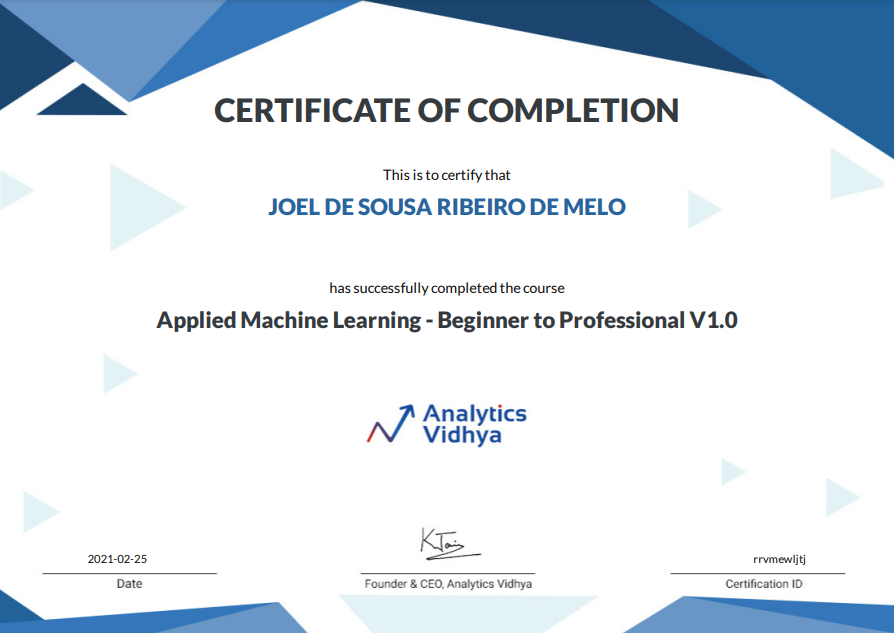
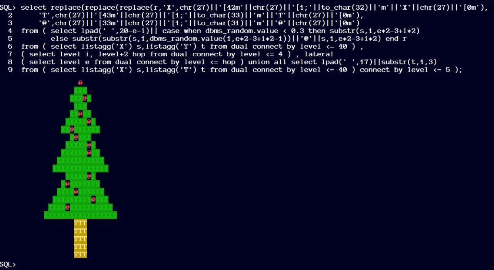
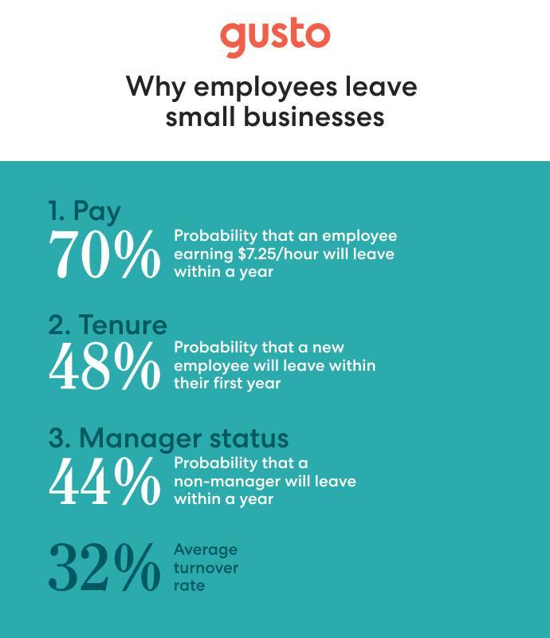
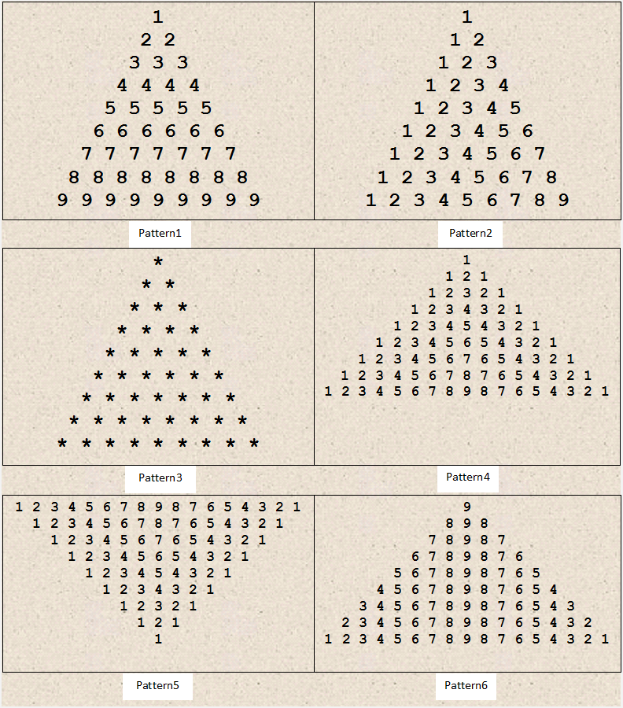

## Round 2 of 100DaysOfMLCode

My journey through 100 days of ML code. 

Minha jornada do desafio 100 dias de código de Machine Learning

emoticon for commit https://gitmoji.carloscuesta.me/
#100DaysOfCode
Imagens
''' 

## Round 2 - 146/152 - 27/02/2021 -  Saturday
Studying Tableau Dataviz - Part II 
#100DaysOfMLCode #AnalyticsVidhya #tableau #dataviz

## Round 2 - 145/152 - 26/02/2021 -  Friday
Studying Tableau Dataviz 
#100DaysOfMLCode #AnalyticsVidhya #tableau #dataviz

## Round 2 - 144/152 - 25/02/2021 -  Thursday
Completed - Applied Machine Learning  - Beginner to Professional - by Analytics Vidhya 
#100DaysOfMLCode #AnalyticsVidhya
 

## Round 2 - 143/152 - 24/02/2021 - Wednesday
AWS Innovate - ML and IA
https://aws.amazon.com/pt/events/innovate-online-conference/americas/ 
#100DaysOfMLCode

## Round 2 - 142/152 - 23/02/2021 -  Tuesday
Hackaton on Analytics Vidhya - Week I - Part 6 
#100DaysOfMLCode

## Round 2 - 141/152 - 22/02/2021 -  Monday
Hackaton on Analytics Vidhya - Week I - Part 5 
#100DaysOfMLCode

## Round 2 - 140/152 - 21/02/2021 -  Sunday
Hackaton on Analytics Vidhya - Week I - Part 4 
#100DaysOfMLCode

## Round 2 - 139/152 - 20/02/2021 -  Saturday
Hackaton on Analytics Vidhya - Week I - Part 3 
#100DaysOfMLCode

## Round 2 - 138/152 - 19/02/2021 -  Friday
Hackaton on Analytics Vidhya - Week I - Part 2 
#100DaysOfMLCode

## Round 2 - 137/151 - 18/02/2021 -  Thursday
Hackaton on Analytics Vidhya - Week I - Part 1 
#100DaysOfMLCode

## Round 2 - 136/151 - 17/02/2021 -  Wednesday
Hackaton on Analytics Vidhya 
#100DaysOfMLCode

## Round 2 - 135/151 - 16/02/2021 -  Tuesday
System Architecture Bootcamp concluded by IGTI 
#100DaysOfMLCode

## Round 2 - 134/151 - 15/02/2021 -  Monday
Solving simple problems with recursion (not ML) 
#100DaysOfMLCode

## Round 2 - 133/151 - 14/02/2021 -  Sunday
Studying data governace with Power Platform - part III 
#100DaysOfMLCode

## Round 2 - 132/151 - 13/02/2021 -  Saturday
Studying data governace with Power Platform - part II 
#100DaysOfMLCode

## Round 2 - 131/151 - 12/02/2021 -  Friday
Studying data governace with Power Platform 
#100DaysOfMLCode

## Round 2 - 130/151 - 11/02/2021 -  Thursday
Bootcamp System Architecture complete - by IGTI 
#100DaysOfMLCode

## Round 2 - 129/151 - 10/02/2021 -  Wednesday
Dev Summit II by IGTI 
#100DaysOfMLCode

## Round 2 - 128/151 - 09/02/2021 -  Tuesday
Using powershell to generate dashboard automatically - Part II 
#100DaysOfMLCode

## Round 2 - 127/151 - 08/02/2021 -  Monday
Using powershell to generate dashboard automatically 
#100DaysOfMLCode

## Round 2 - 126/151 - 07/02/2021 -  Sunday
Studying DAX Functions - Time Control 
#100DaysOfMLCode

## Round 2 - 125/151 - 06/02/2021 -  Saturday
Studying DAX Functions 
#100DaysOfMLCode

## Round 2 - 124/151 - 05/02/2021 -  Friday
Studying BERT - Part III 
#100DaysOfMLCode

## Round 2 - 123/151 - 04/02/2021 -  Thursday
Studying BERT - Part II 
#100DaysOfMLCode

## Round 2 - 122/151 - 03/02/2021 -  Wednesday
Studying BERT 
#100DaysOfMLCode

## Round 2 - 121/151 - 02/02/2021 -  Tuesday
Studying for Exams in ML - Part III 
#100DaysOfMLCode

## Round 2 - 120/151 - 01/02/2021 -  Monday
Studying for Exams in ML - Part II 
#100DaysOfMLCode

## Round 2 - 119/151 - 28/01/2021 to 31/01/2021 -  Sunday
Studying for Exams in ML 
#100DaysOfMLCode

## Round 2 - 116/151 - 23/01/2021 to 28/01/2021 -  Thursday
PowerBI Administration and ML functions Course.
Six days of intense learning!
 
#100DaysOfMLCode

## Round 2 - 110/151 - 22/01/2021 -  Friday
Automate functions with PowerShell III
 
#100DaysOfMLCode

## Round 2 - 109/151 - 21/01/2021 -  Thursday
Automate functions with PowerShell II
 
#100DaysOfMLCode

## Round 2 - 108/151 - 20/01/2021 -  Wednesday
Automate functions with PowerShell
 
#100DaysOfMLCode

## Round 2 - 107/151 - 19/01/2021 -  Thuesday
Studying Pandas
 
#100DaysOfMLCode

## Round 2 - 106/151 - 18/01/2021 -  Monday
Silence Code IV
 
#100DaysOfMLCode

## Round 2 - 105/151 - 17/01/2021 -  Sunday
Silence Code III
 
#100DaysOfMLCode

## Round 2 - 104/151 - 16/01/2021 -  Saturday
Silence Code II
 
#100DaysOfMLCode

## Round 2 - 103/151 - 15/01/2021 -  Friday
Silence Code
 
#100DaysOfMLCode

## Round 2 - 102/151 - 14/01/2021 -  Thursday
Using ML in Power BI Report II
 
#100DaysOfMLCode

## Round 2 - 101/151 - 13/01/2021 -  Wednesday
Using ML in Power BI Report
 
#100DaysOfMLCode

## Round 2 - 100/151 - 12/01/2021 -  Tuesday
Learning Golang - part XI
 
#100DaysOfMLCode

## Round 2 - 99/151 - 11/01/2021 -  Monday
Learning Golang - part X
 
#100DaysOfMLCode

## Round 2 - 98/151 - 10/01/2021 -  Sunday
Learning Golang - part IX
 
#100DaysOfMLCode

## Round 2 - 97/151 - 09/01/2021 -  Saturday
Learning Golang - part VIII
 
#100DaysOfMLCode

## Round 2 - 96/151 - 08/01/2021 -  Friday
Learning Golang - part VII
 
#100DaysOfMLCode

## Round 2 - 95/151 - 07/01/2021 -  Thursday
Learning Golang - part VI
 
#100DaysOfMLCode

## Round 2 - 94/151 - 06/01/2021 -  Wednesday
Learning Golang - part V
 
#100DaysOfMLCode

## Round 2 - 93/151 - 05/01/2021 -  Tuesday
Learning Golang - part IV
 
#100DaysOfMLCode

## Round 2 - 92/151 - 04/01/2021 -  Monday
Learning Golang - part III
 
#100DaysOfMLCode

## Round 2 - 91/151 - 03/01/2021 -  Sunday
Learning Golang - part II
 
#100DaysOfMLCode
 

## Round 2 - 90/151 - 02/01/2021 - Saturday
Learning Golang
 
#100DaysOfMLCode
 

## Round 2 - 89/151 - 01/01/2021 - Friday
Happy new year!
 
#100DaysOfMLCode
 

## Round 2 - 88/151 - 31/12/2020 - Thursday
Dengue 🦟, covid 🦠, economic crisis💸, etc. 
"I am Brazilian, and I never give up."🚀🚀🚀 : 
.
-09 bootcamps. 
-10 Hackatons. 
-#100DaysofCode100 tracked 3 times, I´m in fourth time. 
-03 major systems developed for the cloud production and on time. 
-Completion of long-term courses: Data Analysis, Data Architecture, DevOps and Cloud Computing.  
-Implementation of more than 30 pipelines.  
-Creation of the Data Science department.  
-Substitute boss and supervisor of interns (I like that a lot!) 💻 
And thank you very much to you who helped me get here directly or indirectly! 
Thanks a lot! 🙏🙏🙏 
Happy New Year!
 
#100DaysOfMLCode
 

## Round 2 - 87/151 - 30/12/2020 - Wednesday
Text search with Sonic - Node.js, part II
 
#100DaysOfMLCode

## Round 2 - 86/151 - 29/12/2020 - Tuesday
Text search with Sonic - Node.js
 
#100DaysOfMLCode

## Round 2 - 85/151 - 28/12/2020 - Monday
Optimizing text search in PostgreSQL
 
#100DaysOfMLCode

## Round 2 - 84/151 - 27/12/2020 - Sunday
SVM algorithm exercises II
 
#100DaysOfMLCode

## Round 2 - 83/151 - 26/12/2020 - Saturday
SVM algorithm exercises
 
#100DaysOfMLCode

## Round 2 - 82/151 - 25/12/2020 - Friday
Qwiklabs!
https://go.qwiklabs.com/holiday-speedrun
 
#100DaysOfMLCode

## Round 2 - 81/151 - 24/12/2020 - Thursday
#100DaysOfMLCode
 

## Round 2 - 80/151 - 23/12/2020 - Wednesday
Time to do a fit/predict for 2020!
 
#100DaysOfMLCode

## Round 2 - 79/151 - 22/12/2020 - Tuesday
Retake Terraform course by linuxtips
 
#100DaysOfMLCode

## Round 2 - 78/151 - 21/12/2020 - Monday
Delivering new ML System on PROD \o.
 
#100DaysOfMLCode

## Round 2 - 77/151 - 20/12/2020 - Sunday
Solving exercises on analytics ||
 
#100DaysOfMLCode

## Round 2 - 76/151 - 19/12/2020 - Saturday
Solving exercises on analytics.
 
#100DaysOfMLCode

## Round 2 - 75/151 - 18/12/2020 - Friday
Delivering another ML application!
 
#100DaysOfMLCode

## Round 2 - 74/151 - 17/12/2020 - Thursday
Finished Packer course  by LinuxTips
 
#100DaysOfMLCode
 

## Round 2 - 73/151 - 16/12/2020 - Wednesday
Finished Vault course  by LinuxTips
 
#100DaysOfMLCode
 

## Round 2 - 72/151 - 15/12/2020 - Tuesday
Finished Ansible course  by LinuxTips
 
#100DaysOfMLCode
 

## Round 2 - 71/151 - 14/12/2020 - Monday
Finished Terraform course  by LinuxTips
 
#100DaysOfMLCode
 

## Round 2 - 70/151 - 13/12/2020 - Sunday
Working on search engine for React/Node
 
#100DaysOfMLCode

## Round 2 - 69/151 - 12/12/2020 - Saturday
twisted the spine :(, no code today, all day in bed
 
#100DaysOfMLCode #github

## Round 2 - 68/151 - 11/12/2020 - Friday
Re: Invent by AWS
 
#100DaysOfMLCode #github

## Round 2 - 67/151 - 10/12/2020 - Thursday
Git Universe, last day
 
https://githubuniverse.com/schedule/?utm_source=announcement&utm_medium=email&utm_campaign=amer-githubuniverse-day3
 
#100DaysOfMLCode #github

## Round 2 - 66/151 - 09/12/2020 - Wednesday 
Finished! Applied Data Science II: Machine Learning & Statistical Analysis (with honors)
 

 
#100DaysOfMLCode #wqu

## Round 2 - 65/151 - 08/12/2020 - Tuesday 
Git Universe is OPEN!
 
https://githubuniverse.com/schedule/?utm_source=announcement&utm_medium=email&utm_campaign=amer-githubuniverse-tmrw
 
#100DaysOfMLCode #github

## Round 2 - 64/151 - 07/12/2020 - Monday 
Finished \o
Introduction to Data Science V1.0 Course by Analytics Vidhya
 
#100DaysOfMLCode #AnalyticsVidhya

## Round 2 - 63/151 - 06/12/2020 - Sunday 
Finished \o
AI and ML for Business Leaders Course by Analytics Vidhya
 
#100DaysOfMLCode #AnalyticsVidhya

## Round 2 - 62/151 - 05/12/2020 - Saturday 
Solving Kaggle lessons II
 
#100DaysOfMLCode

## Round 2 - 61/151 - 04/12/2020 - Friday 
Solving Kaggle lessons
 
#100DaysOfMLCode

## Round 2 - 60/151 - 03/12/2020 - Thursday 
Docker loses support on Kubernetes, wow!
 
#100DaysOfMLCode

## Round 2 - 59/151 - 02/12/2020 - Wednesday 
Take care of your data! Don´t save user/password in base64 in your HTML, *.js, *.PNG.
 
https://www.engadget.com/brazil-covid-19-patients-personal-data-exposed-215910641.html
 
#100DaysOfMLCode

## Round 2 - 58/151 - 01/12/2020 - Tuesday 
Solving ML exercises from Analytics Vidhya site
#100DaysOfMLCode

## Round 2 - 57/151 - 30/11/2020 - Monday 
I´m half recovered!
 
#100DaysOfMLCode

## Round 2 - 56/149 - 29/11/2020 - Sunday 
Sick yeat, may be covid :(, all day in bed
 
#100DaysOfMLCode

## Round 2 - 55/149 - 28/11/2020 - Saturday 
I got sick, may be covid :(
 
#100DaysOfMLCode

## Round 2 - 54/149 - 27/11/2020 - Friday 
Solving exercises with clustering
 
#100DaysOfMLCode

## Round 2 - 53/149 - 26/11/2020 - Thursday 
Completed - Infra-as-code by #linuxtips
https://www.linuxtips.io/
 
#100DaysOfMLCode

## Round 2 - 52/149 - 25/11/2020 - Wednesday 
Age Prediction Hackaton
https://datahack.analyticsvidhya.com/contest/age-prediction/
 
#100DaysOfMLCode

## Round 2 - 51/149 - 24/11/2020 - Tuesday 
Started twitter sentiment analysis - yeah you saw this many times, kkkk
defying gravity baby!
 
#100DaysOfMLCode

## Round 2 - 50/149 - 23/11/2020 - Monday 
My analysis on NYC Taxi Trip Duration Dataset was aproved \o
rocket baby!
 
#100DaysOfMLCode

## Round 2 - 49/148 - 22/11/2020 - Sunday 
Introduction on CNN
google colab
 
#100DaysOfMLCode

## Round 2 - 48/148 - 21/11/2020 - Saturday 
Setting VM for Deep Learning II
google colab
 
#100DaysOfMLCode

## Round 2 - 47/148 - 20/11/2020 - Friday 
Setting VM for Deep Learning
https://console.paperspace.com/signup
 
#100DaysOfMLCode

## Round 2 - 46/148 - 19/11/2020 - Thursday 
Structured Query Language (SQL) for Data Science
 
#100DaysOfMLCode

## Round 2 - 45/148 - 18/11/2020 - Tuesay 
Structured Thinking for Data Science II
 
#100DaysOfMLCode

## Round 2 - 44/148 - 17/11/2020 - Monday 
Structured Thinking for Data Science
 
#100DaysOfMLCode

## Round 2 - 43/148 - 16/11/2020 - Monday 
PODMAN or DOCKER:
-infra for ML
 
#100DaysOfMLCode

## Round 2 - 42/148 - 15/11/2020 - Sunday 
WQU Machine learning - finished all exercises
Getting start about infra for ML
 
#100DaysOfMLCode

## Round 2 - 41/148 - 14/11/2020 - Saturday 
WQU Machine learning - solving NLP exercises XI 
 
#100DaysOfMLCode

## Round 2 - 40/148 - 13/11/2020 - Friday 
WQU Machine learning - solving NLP exercises X 
 
#100DaysOfMLCode

## Round 2 - 39/148 - 12/11/2020 - Thursday 
WQU Machine learning - solving exercises IX
 
#100DaysOfMLCode #youtubedown #Pennsylvania

## Round 2 - 38/148 - 11/11/2020 - Wednesday 
WQU Machine learning - solving exercises VIII
 
#100DaysOfMLCode #youtubedown

## Round 2 - 37/148 - 10/11/2020 - Tuesday 
WQU Machine learning - solving exercises VII
 
#100DaysOfMLCode

## Round 2 - 36/148 - 09/11/2020 - Monday 
WQU Machine learning - solving exercises VI
 
#100DaysOfMLCode

## Round 2 - 35/148 - 08/11/2020 - Sunday 
WQU Machine learning - solving exercises V
 
#100DaysOfMLCode

## Round 2 - 34/148 - 07/11/2020 - Saturday 
WQU Machine learning - solving exercises IV
 
#100DaysOfMLCode

## Round 2 - 33/148 - 06/11/2020 - Friday 
WQU Machine learning - solving exercises |||
 
#100DaysOfMLCode

## Round 2 - 32/148 - 05/11/2020 - Thursday 
Security in ML is very important!!! Data security.
 
https://www.bleepingcomputer.com/news/security/brazils-court-system-under-massive-ransomexx-ransomware-attack/
 
#100DaysOfMLCode

## Round 2 - 31/148 - 04/11/2020 - Wednesday 
Mounting graphs 
 

 
#100DaysOfMLCode

## Round 2 - 30/148 - 03/11/2020 - Tuesday 
WQU Machine learning - solving exercises II - o/
#100DaysOfMLCode

## Round 2 - 29/148 - 31/10/2020 through 02/11/2020 - Monday 
Optimizing Postgres text search
#100DaysOfMLCode

## Round 2 - 26/148 - 30/10/2020 - Friday
Using some NLP on Postgres
#100DaysOfMLCode

## Round 2 - 25/147 - 28/10/2020 - Wednesday
WQU Machine learning - solving exercises o/
#100DaysOfMLCode

## Round 2 - 24/147 - 27/10/2020 - Tuesday
Improving perfomance on postgre using GIN/GIST
 #100DaysOfMLCode

## Round 2 - 23/147 - 26/10/2020 - Monday
Solving leetcode problems II
 #100DaysOfMLCode

## Round 2 - 22/142 - 21/10/2020 - Wednesday
Solving leetcode problems
 #100DaysOfMLCode

## Round 2 - 22/142 - 20/10/2020 - Tuesday
Configuring new dev system on ubuntu
 #100DaysOfMLCode

## Round 2 - 21/142 - 19/10/2020 - Monday
Fixing bug in my git repository
 #100DaysOfMLCode

## Round 2 - 20/142 - 18/10/2020 - Sunday
Postgre - with 100K records in JSONB - return in 0.5 sec
Postgre - with 100M records in JSONB - return in 10 minutes!!!
 What a difference!
 #100DaysOfMLCode

## Round 2 - 19/142 - 17/10/2020 - Saturday
WQU Machine learning  - solving exercises
 #100DaysOfMLCode

## Round 2 - 18/142 - 16/10/2020 - Friday
WQU Machine learning class -https://www.youtube.com/watch?v=9J6FNvil6Gw&feature=youtu.be&ab_channel=WQUDataScienceModule
 #100DaysOfMLCode

## Round 2 - 17/142 - 15/10/2020 - Thursday
Mounting a VM with 50Gb of data and pipelines: sqlite -> postgre -> mongoDb -> Spark
 #100DaysOfMLCode

## Round 2 - 16/142 - 14/10/2020 - Wednesday
I was paused this track due a night job, now I back again.
Studying piramidal constructor
 #100DaysOfMLCode
 

 
https://javaconceptoftheday.com/how-to-create-pyramid-of-numbers-in-java/

## Round 2 - 15/119 - 20/09/2020 - Sunday
Rising a Postgre db on unbutu
 #100DaysOfMLCode

## Round 2 - 14/119 - 19/09/2020 - Saturday
Using Google Cloud for a cloupe days, the billing scare me! R$ 145 for a database
 #100DaysOfMLCode

## Round 2 - 13/119 - 18/09/2020 - Friday
R$60(USD 10) for 12 hours using a Postgree! WOW
 #100DaysOfMLCode

## Round 2 - 12/119 - 17/09/2020 - Thursday
Deploying a postgre and trying to impor sqlite3 to it
 #100DaysOfMLCode

## Round 2 - 11/119 - 16/09/2020 - Wednesday
Got sick, covid19 suspect, but the code doesn´t stop.
 #100DaysOfMLCode

## Round 2 - 10/105 - 30/08/2020 to 02/09/2020 - Wednesday
Working at nigth throw dawn to delivery a healthcare application. I need a rest
 #100DaysOfMLCode

## Round 2 - 6/105 - 29/08/2020 - Saturday
Using Heroku to deploy my app
 #100DaysOfMLCode

## Round 2 - 5/100 - 24/08/2020 - Monday
Using IA on powerapps
 #100DaysOfMLCode

## Round 2 - 4/100 - 23/08/2020 - Sunday
Using Kafka to read 1.7Tb data - pART III
 #100DaysOfMLCode

## Round 2 - 3/100 - 22/08/2020 - Saturday
Using Kafka to read 1.7Tb data - pART II
 #100DaysOfMLCode

## Round 2 - 2/100 - 21/08/2020 - Friday
Using Kafka to read 1.7Tb data
 #100DaysOfMLCode

## Round 2 - 1/100 - 20/08/2020 - Thursday
Bjarne Stroustrup: C++ | Lex Fridman Podcast #48
https://www.youtube.com/watch?v=uTxRF5ag27A

 #100DaysOfMLCode
