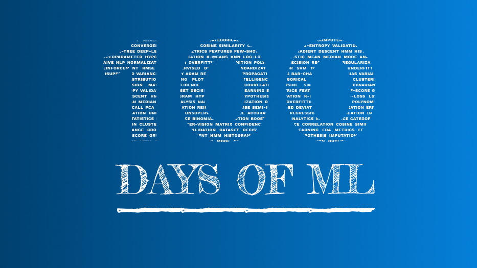

## Round 3 of 100DaysOfMLCode

My journey through 100 days of ML code. Third Round

Minha jornada do desafio 100 dias de código de Machine Learning

emoticon for commit https://gitmoji.carloscuesta.me/
#100DaysOfCode
Imagens
''' 

## Round 3- 8/100 - 25/03/2021 - Thursday
AnalysisGame Of Thrones  dataset, to find out which lives ou dies, predicting the fate of characters 
https://www.kaggle.com/mylesoneill/game-of-thrones 
#100DaysOfMLCode 

## Round 3- 7/100 - 24/03/2021 - Wednesday
using Banknote's authentication dataset to find out which forecasting algorithm is best for this case: KNN, Decision Tree, Random Forest, SVM, MLP, etc  
https://archive.ics.uci.edu/ml/datasets/banknote+authentication 
#100DaysOfMLCode 

## Round 3- 6/100 - 23/03/2021 - Tuesday
ML Exercise about bike sharing by kaggle  
https://www.kaggle.com/c/bike-sharing-demand/data 
#100DaysOfMLCode

## Round 3- 5/100 - 22/03/2021 - Monday
Learning how make a exaustive hypothesis about data without look it 
#100DaysOfMLCode

## Round 3- 4/100 - 21/03/2021 - Sunday
"Structured Thinking and Communication for Data Science Professionals" course completed! 
#100DaysOfMLCode #AnalyticsVidhya

## Round 3- 3/100 - 20/03/2021 - Saturday
Using version control for power bi projects take a look 
https://github.com/awaregroup/powerbi-vcs 
#100DaysOfMLCode

## Round 3- 2/100 - 19/03/2021 - Friday
Joined in 4th International Data Analysis Olympiad 
https://idao.world/ ! 
#100DaysOfMLCode
 

## Round 3- 1/100 - 18/03/2021 - Thursday
Start of Journey - Round 3! 
#100DaysOfMLCode
 

