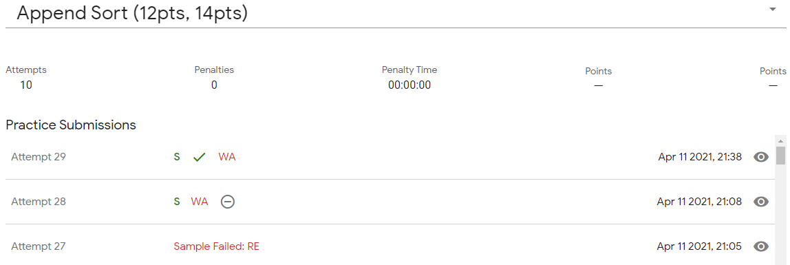

<h1 align="center">
    
     
    100 Days Of Machine Learning Code
</h1>
<h4 align="left">
100 Days of Machine Learning Coding as proposed by Siraj Raval, cloned from https://github.com/Avik-Jain/100-Days-Of-ML-Code    
 My logbooks for #100DaysOfMLCode, if you don´t know what is it, look -> https://https://www.youtube.com/watch?v=cuQMBj1cWPo/
</h4>

 
    
   
   
   

## :rocket: Tracks

Follow me on twitter  https://twitter.com/gortaina and see my track on this journey.

 

| Track           | Status      |
| :--------------: |:-----------:|
|[Logbook Round 1 - Click here ](https://github.com/gortaina/100-Days-Of-ML-Code/blob/master/100DaysOfMLCode_Round1.md) | Complete :rocket: | 
|[Logbook Round 2 - Click here ](https://github.com/gortaina/100-Days-Of-ML-Code/blob/master/100DaysOfMLCode_Round2.md) | Complete :rocket::rocket: | 
|[Logbook Round 3 - Click here ](https://github.com/gortaina/100-Days-Of-ML-Code/blob/master/100DaysOfMLCode_Round3.md) | In Progress :construction: | 

 
 
 
 

## Round 3 of 100DaysOfMLCode

My journey through 100 days of ML code. Third Round

Minha jornada do desafio 100 dias de código de Machine Learning

emoticon for commit https://gitmoji.carloscuesta.me/
#100DaysOfCode
Imagens
''' 

## Round 3- 28/100 - 14/03/2021 - Wednesday
\o/ Practice on Coding \o/ 
#100DaysOfMLCode 
 

## Round 3- 27/100 - 13/03/2021 - Tuesday
Dataset Analysis, tunninh hyperparameters for:
SVC, Random Forest Classifier, with Random Search
https://www.openml.org/d/1480 
 
#100DaysOfMLCode 

## Round 3- 26/100 - 12/03/2021 - Monday
Coding practice on Google JAM Archives - PArt II 
Half complete \o  
#100DaysOfMLCode 

never_give_up_2021-04-12_10-04-24.png

## Round 3- 25/100 - 11/03/2021 - Sunday
Coding practice on Google JAM Archives 
#100DaysOfMLCode 

## Round 3- 24/100 - 10/03/2021 - Saturday
Google JAM Roun 1 :( I dind´t pass for next round, a little disappointed, well,  I need study more and more practice!!! 
#100DaysOfMLCode 

## Round 3- 23/100 - 09/03/2021 - Friday
Google JAM Roun 1 
#100DaysOfMLCode 

## Round 3- 22/100 - 08/03/2021 - Thursday
Open.ml hackaton! 
#100DaysOfMLCode 

## Round 3- 21/100 - 07/03/2021 - Wednesday
Big Notation! Translate search functions from O(n!) to best case such as O(1), O(logn), O(n)... 
#100DaysOfMLCode 

## Round 3- 20/100 - 06/03/2021 - Tuesday
EDA on datasets: bloodtransfer, wine and diabetes - Part II 
#100DaysOfMLCode 

## Round 3- 19/100 - 05/03/2021 - Monday
EDA on datasets: bloodtransfer, wine and diabetes 
#100DaysOfMLCode 

## Round 3- 18/100 - 04/03/2021 - Sunday
Solving  HackerRank problems \0 
#100DaysOfMLCode 

## Round 3- 17/100 - 03/04/2021 - Saturday
watching Keras class part III 
#100DaysOfMLCode 

## Round 3- 16/100 - 02/04/2021 - Friday
watching Keras class part II 
#100DaysOfMLCode 

## Round 3- 15/100 - 01/04/2021 - Thursday
watching Keras class 
#100DaysOfMLCode 

## Round 3- 14/100 - 31/03/2021 - Wednesday
Kaggle competitions \o 
#100DaysOfMLCode 

## Round 3- 13/100 - 30/03/2021 - Tuesday
Solving  HackerRank problems 
#100DaysOfMLCode 

## Round 3- 12/100 - 29/03/2021 - Monday
Google JAM - Round Qualified \o 
"Congratulations — you've qualified for Round 1 of Code Jam 2021 — great work!" :rocket::rocket::rocket: 
#100DaysOfMLCode 

## Round 3- 11/100 - 28/03/2021 - Sunday
Hacker Rank - solving exercises 
https://www.hackerrank.com/ 
#100DaysOfMLCode 

## Round 3- 10/100 - 27/03/2021 - Saturday
Google JAM 2021  
https://codingcompetitions.withgoogle.com/codejam/ 
#100DaysOfMLCode 
c

## Round 3- 9/100 - 26/03/2021 - Friday
Data analysis of 50 Startups dataset, find out correlaton between R&D Spend and Profit  
https://www.kaggle.com/farhanmd29/50-startups 
#100DaysOfMLCode 

## Round 3- 8/100 - 25/03/2021 - Thursday
Data analysis of Game of Thrones dataset, to find out which lives ou dies, predicting the fate of characters 
https://www.kaggle.com/mylesoneill/game-of-thrones 
#100DaysOfMLCode 

## Round 3- 7/100 - 24/03/2021 - Wednesday
using Banknote's authentication dataset to find out which forecasting algorithm is best for this case: KNN, Decision Tree, Random Forest, SVM, MLP, etc  
https://archive.ics.uci.edu/ml/datasets/banknote+authentication 
#100DaysOfMLCode 

## Round 3- 6/100 - 23/03/2021 - Tuesday
ML Exercise about bike sharing by kaggle  
https://www.kaggle.com/c/bike-sharing-demand/data 
#100DaysOfMLCode

## Round 3- 5/100 - 22/03/2021 - Monday
Learning how make a exaustive hypothesis about data without look it 
#100DaysOfMLCode

## Round 3- 4/100 - 21/03/2021 - Sunday
"Structured Thinking and Communication for Data Science Professionals" course completed! 
#100DaysOfMLCode #AnalyticsVidhya

## Round 3- 3/100 - 20/03/2021 - Saturday
Using version control for power bi projects take a look 
https://github.com/awaregroup/powerbi-vcs 
#100DaysOfMLCode

## Round 3- 2/100 - 19/03/2021 - Friday
Joined in 4th International Data Analysis Olympiad 
https://idao.world/ ! 
#100DaysOfMLCode
 

## Round 3- 1/100 - 18/03/2021 - Thursday
Start of Journey - Round 3! 
#100DaysOfMLCode
 

 
 
 
 

___
### Contact
>[  Joel Melo](https://www.linkedin.com/in/joeldemelo/) 
>[   arquitetura.joel@gmail.com](mailto:arquitetura.joel@gmail.com) 
>:octocat:[  gortaina](https://github.com/gortaina) 
>[  gortaina](https://twitter.com/gortaina)

 
:trollface:Utils:trollface:
<h6>https://gitmoji.carloscuesta.me/</h6>
<h6>https://www.quantamagazine.org/the-map-of-mathematics-20200213/</h6>
<h6>https://www.viva64.com/en/b/0706/?utm_source=tm&utm_medium=ai_machinelearning_big_data&utm_campaign=telegram</h6>
<h6>https://www.fast.ai/2020/02/13/fastai-A-Layered-API-for-Deep-Learning/</h6>
<h6>http://unbouncepages.com/dream2bbatchai/</h6>
<h6>http://livros-matema.blogspot.com/</h6>
<h6>https://www.daxpatterns.com/</h6>
<h6>https://www.r-graph-gallery.com/</h6>
<h6>https://sqlitebrowser.org/</h6>
<h6>https://towardsdatascience.com/on-average-youre-using-the-wrong-average-geometric-harmonic-means-in-data-analysis-2a703e21ea0</h6>
<h6>https://mathforum.org/library/drmath/view/69480.html</h6>

