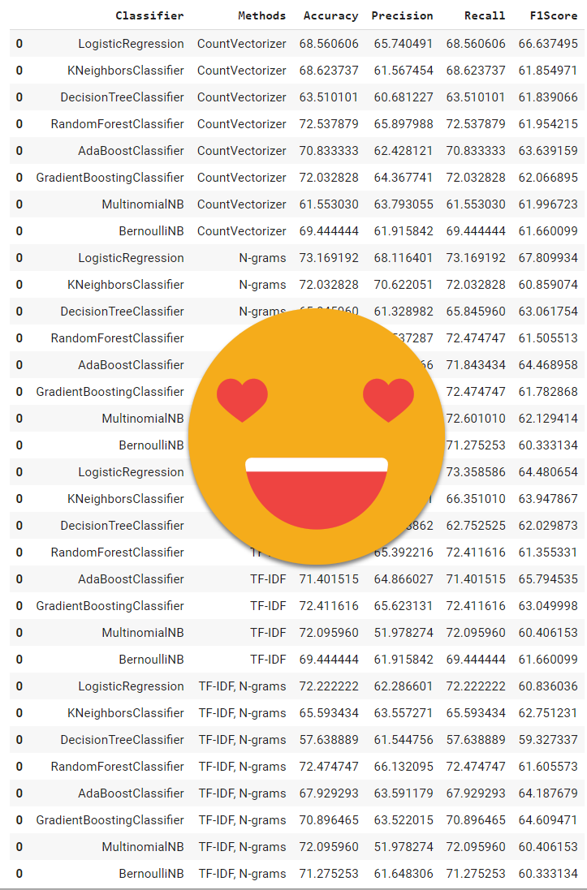
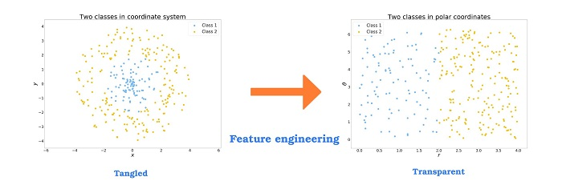
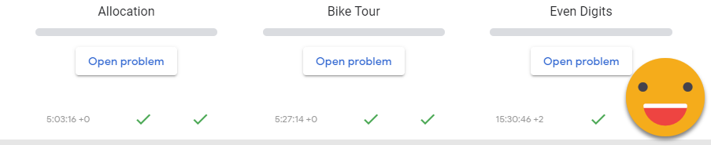
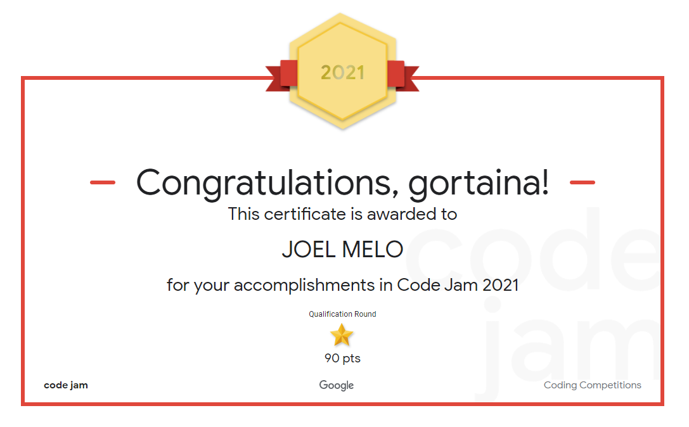

<h1 align="center">
    
     
    100 Days Of Machine Learning Code
</h1>
<h4 align="left">
100 Days of Machine Learning Coding as proposed by Siraj Raval, cloned from https://github.com/Avik-Jain/100-Days-Of-ML-Code    
 My logbooks for #100DaysOfMLCode, if you don´t know what is it, look -> https://https://www.youtube.com/watch?v=cuQMBj1cWPo/
</h4>

 
    
   
   
   

## :rocket: Tracks

Follow me on twitter  https://twitter.com/gortaina and see my track on this journey.

 

| Track           | Status      |
| :--------------: |:-----------:|
|[Logbook Round 1 - Click here ](https://github.com/gortaina/100-Days-Of-ML-Code/blob/master/100DaysOfMLCode_Round1.md) | Complete :rocket: | 
|[Logbook Round 2 - Click here ](https://github.com/gortaina/100-Days-Of-ML-Code/blob/master/100DaysOfMLCode_Round2.md) | Complete :rocket::rocket: | 
|[Logbook Round 3 - Click here ](https://github.com/gortaina/100-Days-Of-ML-Code/blob/master/100DaysOfMLCode_Round3.md) | In Progress :construction: | 

 
 
 
 

## Round 3 of 100DaysOfMLCode

My journey through 100 days of ML code. Third Round

Minha jornada do desafio 100 dias de código de Machine Learning

emoticon for commit https://gitmoji.carloscuesta.me/
#100DaysOfCode
Imagens
''' 

# Round 3 - 78/100 - 03/06/2021 - Thursday
Django on data! - part II
#100DaysOfMLCode 

# Round 3 - 77/100 - 02/06/2021 - Wednesday
Django on data!
#100DaysOfMLCode 

# Round 3 - 76/100 - 01/06/2021 - Tuesday
Governance on data?
https://medium.com/swlh/data-lake-design-for-better-architecture-storage-security-data-governance-16d2a36721ba
#100DaysOfMLCode 

# Round 3 - 75/100 - 31/05/2021 - Monday
How to spot a data charlatan ? Read this:
https://towardsdatascience.com/how-to-spot-a-data-charlatan-85785c991433
#100DaysOfMLCode 

# Round 3 - 74/100 - 30/05/2021 - Sunday
think that I don´t understanding:
On LSTM model, I reach on 0.8 on f1-Score, but in generalization falls to 0.266
On OneVsRestClassifier, I reach on .3 on f1-Score, but in generalization increase to 0.43
What hell is this ? 😖😖😖
#100DaysOfMLCode 

# Round 3 - 73/100 - 29/05/2021 - Saturday
Sentiment Analysis a little easier
https://towardsdatascience.com/fine-grained-sentiment-analysis-in-python-part-1-2697bb111ed4 
#100DaysOfMLCode 

# Round 3 - 72/100 - 28/05/2021 - Friday
From "It works on my machine!"
to
"It works on my model on my machine!" 😆 
#100DaysOfMLCode 

# Round 3 - 71/100 - 27/05/2021 - Thursday
Refactoring  python code for using pipelines, like that  
simple_pipeline = Pipeline([ 
  ('counts', CountVectorizer()), 
  ('classifier', MultinomialNB()) 
]) 
#100DaysOfMLCode 

# Round 3 - 70/100 - 26/05/2021 - Wednesday
Microsoft Build 2021 🚀 
#100DaysOfMLCode 

# Round 3 - 69/100 - 25/05/2021 - Tuesday
Solving query exercies part II 
#100DaysOfMLCode 

# Round 3 - 68/100 - 24/05/2021 - Monday
Solving query exercies 
#100DaysOfMLCode 

# Round 3 - 67/100 - 23/05/2021 - Sunday
Hackathon on google kickstart 
#100DaysOfMLCode 

# Round 3 - 66/100 - 22/05/2021 - Saturday
Chatboots with Rasa 
#100DaysOfMLCode 

## Round 3 - 65/100 - 21/05/2021 - Friday
Making ETL´s using applestore dataset on powerbi 
#100DaysOfMLCode 

## Round 3 - 64/100 - 20/05/2021 - Thursday
Google I/O - Getting badges and learning TensorFlowLite 
#100DaysOfMLCode 

## Round 3 - 63/100 - 19/05/2021 - Wednesday
Basic "autoML" with many loops and ifs 
#100DaysOfMLCode 
 

## Round 3 - 62/100 - 18/05/2021 - Tuesday
Google I/O  
#100DaysOfMLCode 

## Round 3 - 61/100 - 17/05/2021 - Monday
Using terraform in AWS 
#100DaysOfMLCode 

## Round 3 - 60/100 - 16/05/2021 - Sunday
Reviewing exercises made for WorldQuant University(NLP topic) 
#100DaysOfMLCode 

## Round 3 - 59/100 - 15/05/2021 - Saturday
Finished a bootcamp on Data Science by Alura 
#100DaysOfMLCode 

## Round 3 - 58/100 - 14/05/2021 - Fridayday
Percona event! 
https://events.percona.com/events/details/percona-virtual-presents-percona-live-online/#/
#100DaysOfMLCode 

## Round 3 - 57/100 - 13/05/2021 - Thursday
Learning using Word2Vec and GloVe 

## Round 3 - 56/100 - 12/05/2021 - Wednesday
Learning spaCy for NLP 

## Round 3 - 55/100 - 11/05/2021 - Tuesday
Solving pipelines problems with Rony framework = Part II 

## Round 3 - 54/100 - 10/05/2021 - Monday
Solving pipelines problems with Rony framework 

## Round 3 - 53/100 - 09/05/2021 - Sunday
Sentiment Analisys on LSTM - Part II 
#100DaysOfMLCode 

## Round 3 - 52/100 - 08/05/2021 - Saturday
Sentiment Analisys on LSTM 
#100DaysOfMLCode 

## Round 3 - 51/100 - 07/05/2021 - Friday
Machine Learning for Data Analysis by IGTI 
#100DaysOfMLCode 

## Round 3 - 50/100 - 06/05/2021 - Thursday
ETL on PowerBI is soooo simple! Get to the point 
#100DaysOfMLCode 

## Round 3 - 49/100 - 05/05/2021 - Wednesday
Exercises on Combinatory Analysis 
#100DaysOfMLCode 

## Round 3 - 48/100 - 04/05/2021 - Tuesday
Pandas or Swifter for data clean  
https://medium.com/@jmcarpenter2/swiftapply-automatically-efficient-pandas-apply-operations-50e1058909f9 
#100DaysOfMLCode 

## Round 3 - 47/100 - 03/05/2021 - Monday
Getting into Bootcamp Data Engineering with André Sionek 
#100DaysOfMLCode 

## Round 3 - 46/100 - 02/05/2021 - Sunday
30 days of code complete - HackerRank 
#100DaysOfMLCode 

## Round 3 - 45/100 - 01/05/2021 - Saturday
Complete all exercises form Black Belt course - Analytics Vidhya 
#100DaysOfMLCode 

## Round 3 - 44/100 - 30/04/2021 - Friday
Light GBM, XGBoost and CatBoost on "Breakfast-at-the-Frat-master"  dataset, wich is better? 
#100DaysOfMLCode 

## Round 3 - 43/100 - 29/04/2021 - Thursday
Light GBM on "Breakfast-at-the-Frat-master" dataset 
#100DaysOfMLCode 

## Round 3 - 42/100 - 28/04/2021 - Wednesday
Feature Engineering on "Breakfast-at-the-Frat-master" dataset 
#100DaysOfMLCode 
 

## Round 3 - 41/100 - 27/04/2021 - Tuesday
Tensor Flow - Retraining an Image Classifier - tutorial 
#100DaysOfMLCode 
https://www.tensorflow.org/hub/tutorials/tf2_image_retraining?hl=pt
 

## Round 3 - 40/100 - 26/04/2021 - Monday
Retail Demand Prediction - Exercises
#100DaysOfMLCode
 

## Round 3 - 39/100 - 25/04/2021 - Sunday
Google Jam Round 1B 2021
#100DaysOfMLCode
 

## Round 3 - 38/100 - 24/04/2021 - Saturday
Interview with me for "Desenvolvendo Me" channel, check it out:  
#100DaysOfMLCode

 

## Round 3 - 37/100 - 23/04/2021 - Friday
Google Kickstart APAC, mentoring 
#100DaysOfMLCode
 

## Round 3 - 36/100 - 22/04/2021 - Thursday
Fashion MNIST dataset on Keras - Deep Learning
#100DaysOfMLCode

## Round 3 - 35/100 - 21/04/2021 - Wednesday
Hackaton on Kick Start APAC - Google
#100DaysOfMLCode

## Round 3 - 34/100 - 20/04/2021 - Tuesday
Binary Search Tree  - PArt II
#100DaysOfMLCode

## Round 3 - 33/100 - 19/04/2021 - Monday
Binary Search Tree - PArt I
#100DaysOfMLCode

## Round 3 - 32/100 - 18/04/2021 - Sunday
HackerRank updated 
https://www.hackerrank.com/gortaina?badge=30-days-of-code&stars=4&level=2&hr_r=1&utm_campaign=social-buttons&utm_medium=linkedin&utm_source=badge_share&social=linkedin 
#100DaysOfMLCode 

## Round 3 - 31/100 - 17/04/2021 - Saturday
Kick Stark will be open in 30 hours!
https://codingcompetitions.withgoogle.com/kickstart/ 
#100DaysOfMLCode 

## Round 3 - 30/100 - 16/04/2021 - Friday
Time for Qwiklabs \o
https://go.qwiklabs.com/ace-april?utm_source=linkedin&utm_medium=social&utm_campaign=ace-april 
#100DaysOfMLCode 

## Round 3 - 29/100 - 15/04/2021 - Thursday
Part II - Dataset Analysis, tunninh hyperparameters for:
SVC, Random Forest Classifier, with Random Search
https://www.openml.org/d/1480 
#100DaysOfMLCode 

## Round 3 - 28/100 - 14/04/2021 - Wednesday
\o/ Practice on Coding \o/ 
#100DaysOfMLCode 
 

## Round 3 - 27/100 - 13/04/2021 - Tuesday
Dataset Analysis, tunninh hyperparameters for:
SVC, Random Forest Classifier, with Random Search
https://www.openml.org/d/1480 
 
#100DaysOfMLCode 

## Round 3 - 26/100 - 12/04/2021 - Monday
Coding practice on Google JAM Archives - PArt II 
Half complete \o  
#100DaysOfMLCode 

never_give_up_2021-04-12_10-04-24.png

## Round 3 - 25/100 - 11/04/2021 - Sunday
Coding practice on Google JAM Archives 
#100DaysOfMLCode 

## Round 3 - 24/100 - 10/04/2021 - Saturday
Google JAM Roun 1 :( I dind´t pass for next round, a little disappointed, well,  I need study more and more practice!!! 
#100DaysOfMLCode 

## Round 3 - 23/100 - 09/04/2021 - Friday
Google JAM Roun 1 
#100DaysOfMLCode 

## Round 3 - 22/100 - 08/04/2021 - Thursday
Open.ml hackaton! 
#100DaysOfMLCode 

## Round 3 - 21/100 - 07/04/2021 - Wednesday
Big Notation! Translate search functions from O(n!) to best case such as O(1), O(logn), O(n)... 
#100DaysOfMLCode 

## Round 3 - 20/100 - 06/04/2021 - Tuesday
EDA on datasets: bloodtransfer, wine and diabetes - Part II 
#100DaysOfMLCode 

## Round 3 - 19/100 - 05/04/2021 - Monday
EDA on datasets: bloodtransfer, wine and diabetes 
#100DaysOfMLCode 

## Round 3 - 18/100 - 04/04/2021 - Sunday
Solving  HackerRank problems \0 
#100DaysOfMLCode 

## Round 3 - 17/100 - 03/04/2021 - Saturday
watching Keras class part III 
#100DaysOfMLCode 

## Round 3 - 16/100 - 02/04/2021 - Friday
watching Keras class part II 
#100DaysOfMLCode 

## Round 3 - 15/100 - 01/04/2021 - Thursday
watching Keras class 
#100DaysOfMLCode 

## Round 3 - 14/100 - 31/03/2021 - Wednesday
Kaggle competitions \o 
#100DaysOfMLCode 

## Round 3 - 13/100 - 30/03/2021 - Tuesday
Solving  HackerRank problems 
#100DaysOfMLCode 

## Round 3 - 12/100 - 29/03/2021 - Monday
Google JAM - Round Qualified \o 
"Congratulations — you've qualified for Round 1 of Code Jam 2021 — great work!" :rocket::rocket::rocket: 
#100DaysOfMLCode 

## Round 3 - 11/100 - 28/03/2021 - Sunday
Hacker Rank - solving exercises 
https://www.hackerrank.com/ 
#100DaysOfMLCode 

## Round 3 - 10/100 - 27/03/2021 - Saturday
Google JAM 2021  
https://codingcompetitions.withgoogle.com/codejam/ 
#100DaysOfMLCode 
c

## Round 3 - 9/100 - 26/03/2021 - Friday
Data analysis of 50 Startups dataset, find out correlaton between R&D Spend and Profit  
https://www.kaggle.com/farhanmd29/50-startups 
#100DaysOfMLCode 

## Round 3 - 8/100 - 25/03/2021 - Thursday
Data analysis of Game of Thrones dataset, to find out which lives ou dies, predicting the fate of characters 
https://www.kaggle.com/mylesoneill/game-of-thrones 
#100DaysOfMLCode 

## Round 3 - 7/100 - 24/03/2021 - Wednesday
using Banknote's authentication dataset to find out which forecasting algorithm is best for this case: KNN, Decision Tree, Random Forest, SVM, MLP, etc  
https://archive.ics.uci.edu/ml/datasets/banknote+authentication 
#100DaysOfMLCode 

## Round 3 - 6/100 - 23/03/2021 - Tuesday
ML Exercise about bike sharing by kaggle  
https://www.kaggle.com/c/bike-sharing-demand/data 
#100DaysOfMLCode

## Round 3 - 5/100 - 22/03/2021 - Monday
Learning how make a exaustive hypothesis about data without look it 
#100DaysOfMLCode

## Round 3 - 4/100 - 21/03/2021 - Sunday
"Structured Thinking and Communication for Data Science Professionals" course completed! 
#100DaysOfMLCode #AnalyticsVidhya

## Round 3 - 3/100 - 20/03/2021 - Saturday
Using version control for power bi projects take a look 
https://github.com/awaregroup/powerbi-vcs 
#100DaysOfMLCode

## Round 3 - 2/100 - 19/03/2021 - Friday
Joined in 4th International Data Analysis Olympiad 
https://idao.world/ ! 
#100DaysOfMLCode
 

## Round 3 - 1/100 - 18/03/2021 - Thursday
Start of Journey - Round 3! 
#100DaysOfMLCode
 

 
 
 
 

___
### Contact
>[  Joel Melo](https://www.linkedin.com/in/joeldemelo/) 
>[   arquitetura.joel@gmail.com](mailto:arquitetura.joel@gmail.com) 
>:octocat:[  gortaina](https://github.com/gortaina) 
>[  gortaina](https://twitter.com/gortaina)

 
:trollface:Utils:trollface:
<h6>https://gitmoji.carloscuesta.me/</h6>
<h6>https://www.quantamagazine.org/the-map-of-mathematics-20200213/</h6>
<h6>https://www.viva64.com/en/b/0706/?utm_source=tm&utm_medium=ai_machinelearning_big_data&utm_campaign=telegram</h6>
<h6>https://www.fast.ai/2020/02/13/fastai-A-Layered-API-for-Deep-Learning/</h6>
<h6>http://unbouncepages.com/dream2bbatchai/</h6>
<h6>http://livros-matema.blogspot.com/</h6>
<h6>https://www.daxpatterns.com/</h6>
<h6>https://www.r-graph-gallery.com/</h6>
<h6>https://sqlitebrowser.org/</h6>
<h6>https://towardsdatascience.com/on-average-youre-using-the-wrong-average-geometric-harmonic-means-in-data-analysis-2a703e21ea0</h6>
<h6>https://mathforum.org/library/drmath/view/69480.html</h6>

